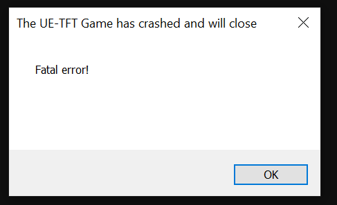

# TFTDx11Watcher

English | [Tiếng Việt](README.vi.md)

`TFTDx11Watcher.exe` is a tiny native Win32 helper written in plain C. It keeps Teamfight Tactics (TFT) configured to use DirectX 11 on systems where the updated Unreal Engine version crashes on its default DirectX 12 path.

## Why this app exists

TFT recently moved to **Unreal Engine**. The updated game starts with **DirectX 12** by default.

Some older graphics cards or integrated GPUs—such as GTX 750-class hardware and older iGPUs—may only provide a practical DirectX 11 path or may not provide the DirectX 12 feature set required by the updated game. On affected systems, TFT can crash during startup with a dialog like this:



The dialog says:

```text
The UE-TFT Game has crashed and will close
Fatal error!
```

The usual workaround is to edit `Engine.ini` before starting the game and add:

```ini
[/Script/WindowsTargetPlatform.WindowsTargetSettings]
DefaultGraphicsRHI=DefaultGraphicsRHI_DX11
```

That manual workaround is inconvenient because TFT may rewrite `Engine.ini` after reading it and remove the DX11 section. You would have to edit the file again before a later launch.

TFTDx11Watcher automates that workaround. It restores the DX11 setting when needed, so the next normal launch from the Riot/League client uses DirectX 11. It can fix this specific graphics-backend startup crash; it does not claim to fix unrelated game crashes.

## Download

Download the packaged release from [GitHub Releases 1.0.0](https://github.com/phamngocduy98/LOL_TFT_DX11/releases/tag/1.0.0).

## What it does

- Reads `%LOCALAPPDATA%` without hard-coding a username.
- Creates the TFT config directory and the initial `Engine.ini` block on startup when necessary.
- Watches the config directory with `ReadDirectoryChangesW()`.
- Re-appends only the DX11 block after TFT modifies, replaces, recreates, or renames `Engine.ini`.
- Uses `OPEN_EXISTING` on the event path, so it does not create a competing file while TFT is replacing one.
- Verifies the marker after appending and retries briefly if TFT immediately rewrites the file.

It does not launch TFT, inject into the game, hook processes, modify files under `D:\Riot Games`, bypass Riot/Vanguard, or change/reset `CachedClientID`.

## Build

Open an **x64 Native Tools Command Prompt for Visual Studio** or a **Developer Command Prompt for VS**, change to this project directory, and run:

```cmd
build.cmd
```

The script uses MSVC `cl.exe` and `rc.exe`, builds a Windows-subsystem release with `/O2 /GL /W4 /WX`, link-time optimization, and dead-code elimination. The application icon is embedded through `TFTDx11Watcher.rc` from the multi-size `appicon.ico` converted from the provided `appicon.png`.

## Test

After building:

```cmd
test.cmd
```

The script checks that the executable exists, starts the watcher, prints the current `Engine.ini`, and tells you to launch TFT normally. After TFT exits, inspect `Engine.ini` again. The watcher never launches TFT itself.

## Install

To start the watcher at user logon:

```cmd
install-task.cmd
```

This creates a Scheduled Task named `TFT DX11 Watcher` with an `ONLOGON` trigger, `LIMITED` run level, and the absolute path to the executable in this directory. It also starts the task immediately. Administrator access is not required when Windows allows the current user to create the task.

## Uninstall

```cmd
uninstall-task.cmd
```

This removes the scheduled task and stops `TFTDx11Watcher.exe` if it is running. It does not delete or reset `Engine.ini`, DX11, or `CachedClientID`.

## How it works

1. The watcher resolves `LOCALAPPDATA` with `GetEnvironmentVariableW()` and ensures the TFT config directory exists.
2. During startup, it opens or creates `Engine.ini` and scans raw bytes for the exact marker `DefaultGraphicsRHI=DefaultGraphicsRHI_DX11`.
3. After a filesystem event, it uses `OPEN_EXISTING` only. If TFT has temporarily deleted or renamed the file, the watcher waits and retries without creating a replacement.
4. If the marker is missing, it appends an ASCII/UTF-8-compatible CRLF block without rewriting existing content.
5. It closes the append handle, reopens the file to verify the marker, and retries briefly if a concurrent TFT rewrite removed it.
6. While idle, the single worker thread blocks in `ReadDirectoryChangesW()`; a zero-byte notification result triggers a one-time reconciliation for possible buffer overflow.

A named mutex, `Local\TFTDx11Watcher.Singleton`, prevents multiple instances.

## Resource usage and safety

There is no long-running polling loop and no continuous `Sleep + check file` cycle. When idle, CPU usage is practically near zero because the thread is blocked in the kernel waiting for a filesystem notification. The process uses one thread, a small notification buffer, and the required directory/file/mutex handles.

The process and thread run at reduced priority. It is a normal user-mode Win32 application with no console window, no Administrator requirement, no game injection, and no Riot/Vanguard bypass.

## Limitations

- File-lock retries are intentionally short and happen only after startup or a filesystem event. A file locked for a long time may require a later event to be reconciled again.
- The event path does not recreate `Engine.ini` if TFT has deleted it but has not recreated it yet.
- Detection is raw-byte based and does not convert the file encoding. TFT config files are expected to be ASCII/UTF-8 compatible.
- The setting is matched exactly. Whitespace variants are treated as missing and cause the standard block to be appended.
- The watcher only prepares the configuration for the next TFT launch; it does not modify a running game.
